# GitHub Pages Smoke Test — 2026-01-20

These snapshots capture the rendered repository landing view and README
sections as visible during the GitHub Pages verification pass. Images are
stored in `docs/screenshots/2026-01-20-gh-pages/`.

## Repository Overview

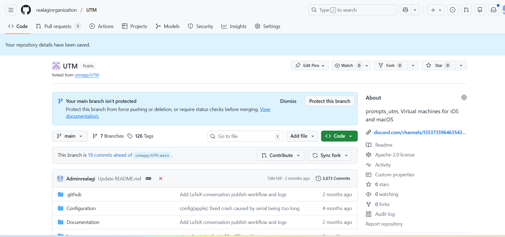
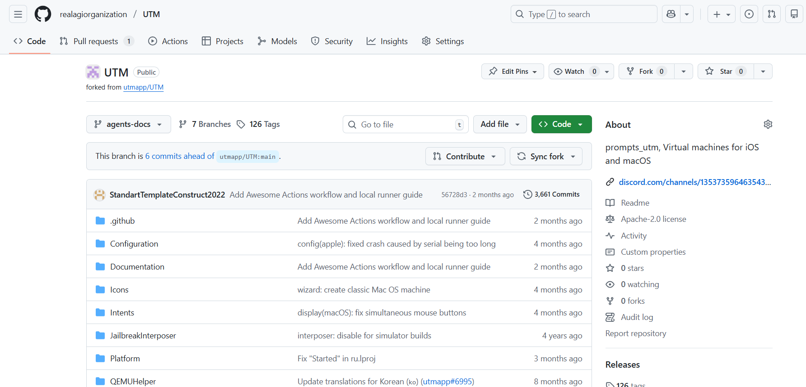
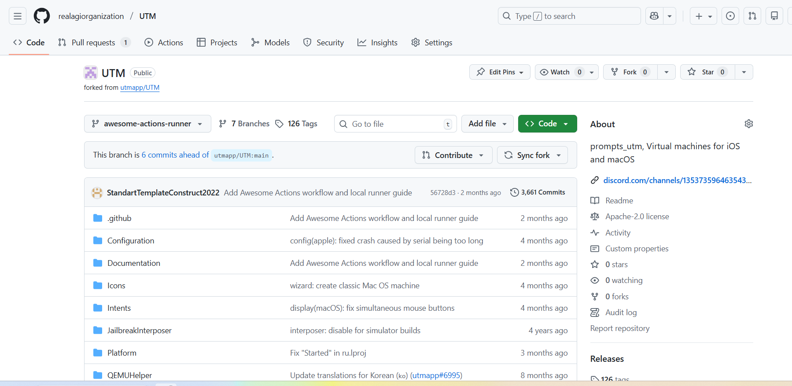

## File Listing Details

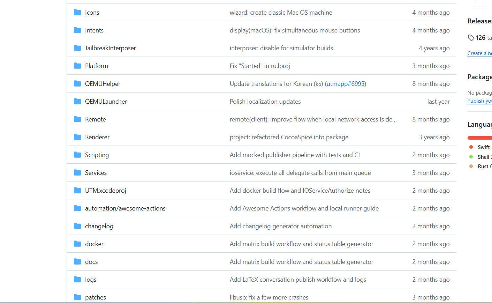
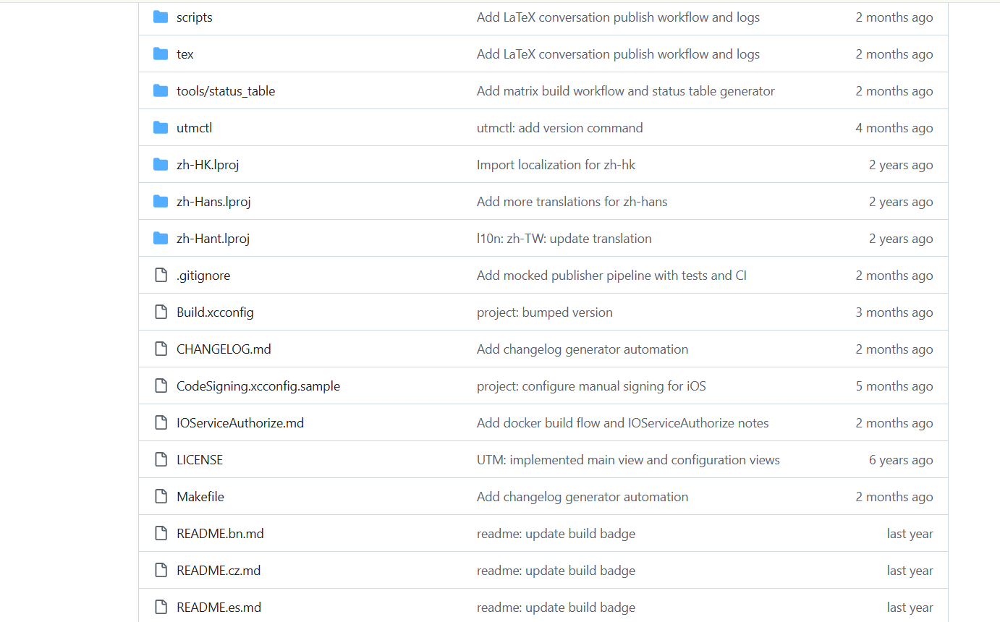
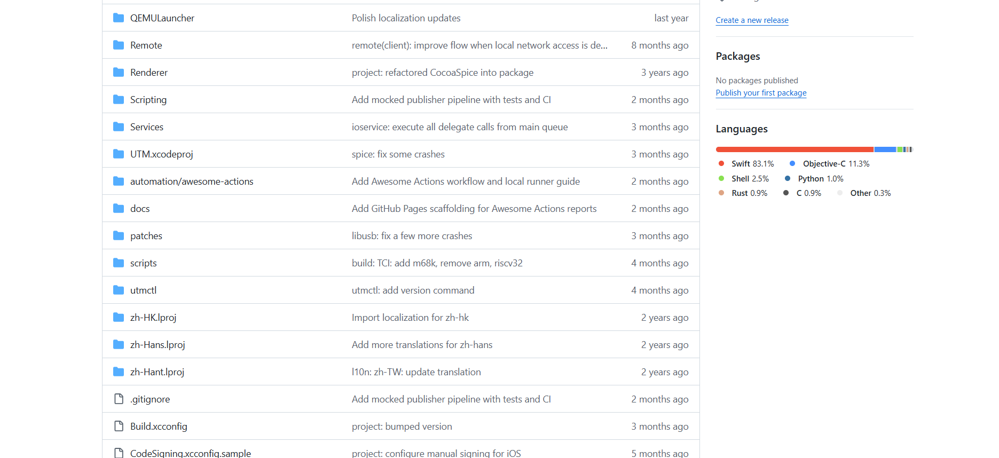
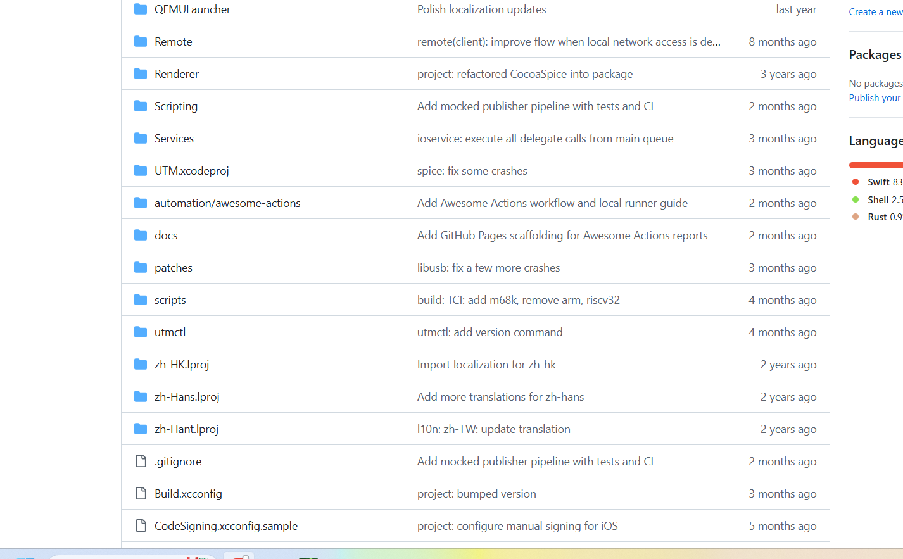

## README Render — Highlights

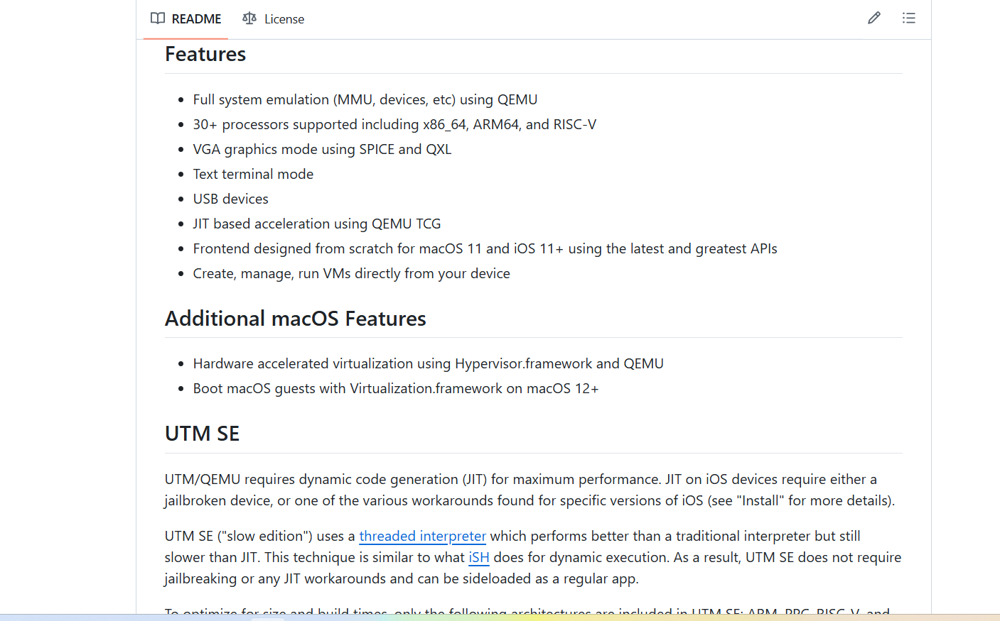
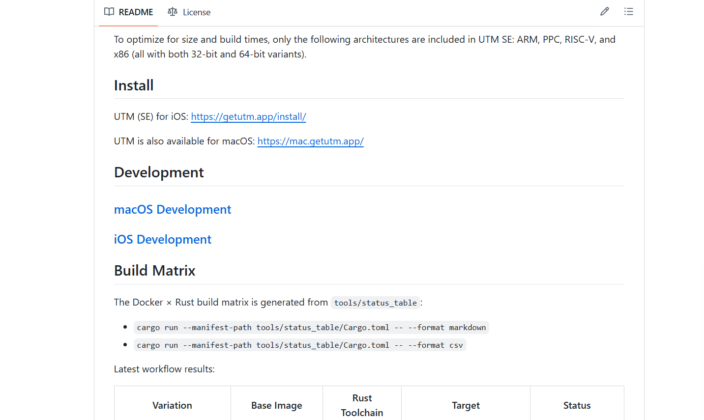
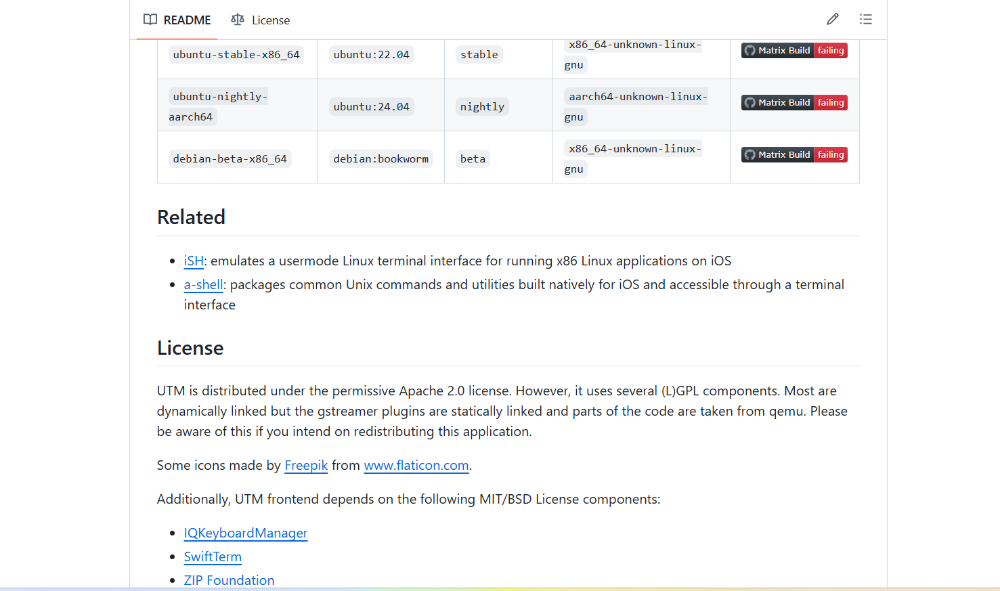

## README Render — Footer Details

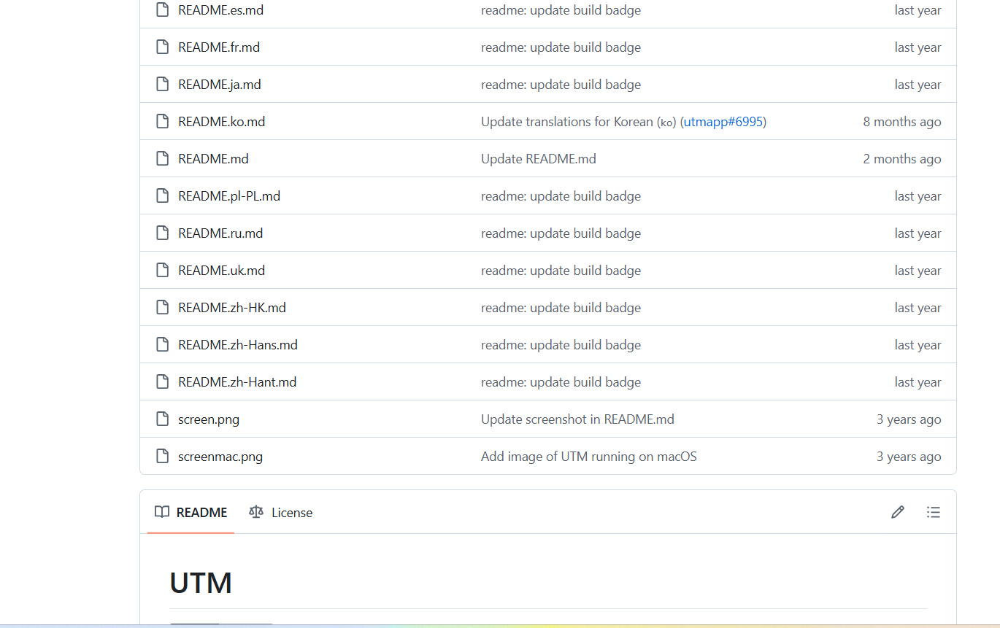
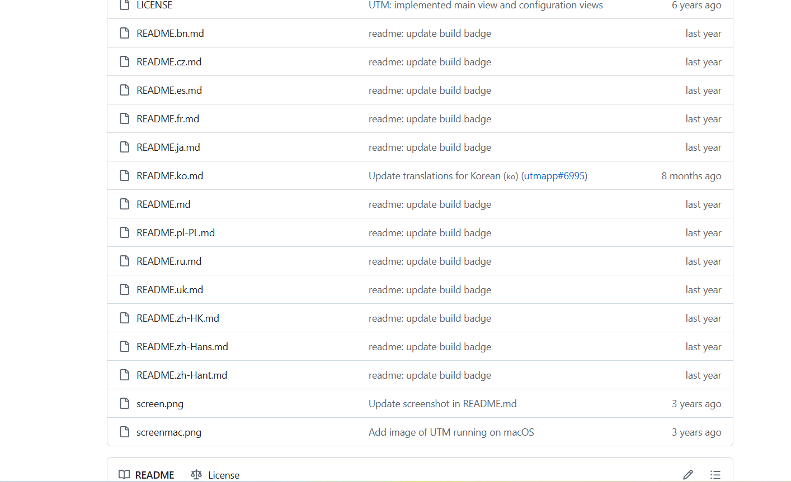
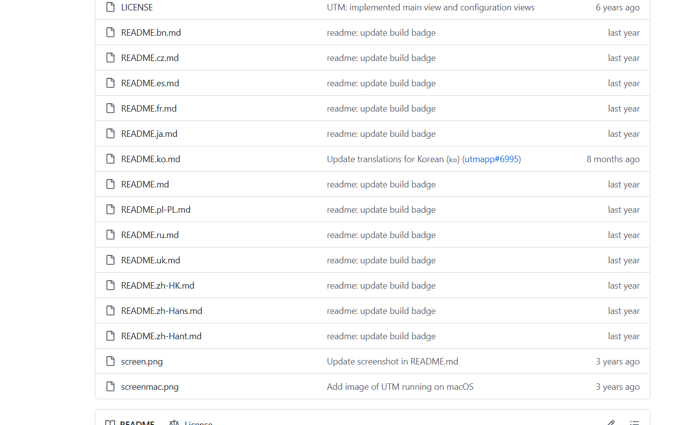
